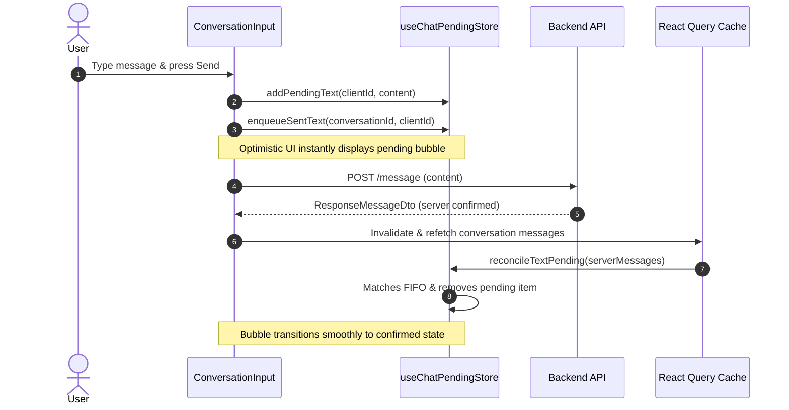

# Instanct Chat Module: Complete Technical Guide

This document provides a comprehensive technical breakdown of the **Chat Module** within the Instanct Mobile Application (`instanct-mobile-app`). It covers architectural patterns, domain modeling, state management, real-time sync strategies, custom React hooks, and the UI component hierarchy.

---

## Table of Contents

1. [Executive Summary & Architectural Overview](#1-executive-summary--architectural-overview)
2. [Domain Schema & Data Models](#2-domain-schema--data-models)
3. [API & Networking Layer](#3-api--networking-layer)
4. [Optimistic UI & Pending Message Engine](#4-optimistic-ui--pending-message-engine)
5. [Custom Hooks Layer](#5-custom-hooks-layer)
6. [UI Component Hierarchy](#6-ui-component-hierarchy)
   - [6.1 Chat Portal & Conversation List](#61-chat-portal--conversation-list)
   - [6.2 Conversation Screen & Header](#62-conversation-screen--header)
   - [6.3 Message Bubbles & Rendering Pipeline](#63-message-bubbles--rendering-pipeline)
   - [6.4 Input Bar, Action Sheets & Media Staging](#64-input-bar-action-sheets--media-staging)
   - [6.5 Search, Conversation Details & Reporting](#65-search-conversation-details--reporting)
7. [Message Lifecycle & Data Flow Diagram](#7-message-lifecycle--data-flow-diagram)
8. [Extension & Troubleshooting Guide](#8-extension--troubleshooting-guide)

---

## 1. Executive Summary & Architectural Overview

The Instanct Chat Module is a high-performance, real-time messaging system built on top of **React Native (Expo)**, **TanStack React Query**, and **Zustand**. It adheres to a clean separation of concerns:

```
┌────────────────────────────────────────────────────────────────┐
│                        UI View Layer                           │
│  components/chat/** (ChatPortal, Conversation, ChatBubble...)  │
└───────────────────────────────▲────────────────────────────────┘
                                │ React Props & Hook Callbacks
┌───────────────────────────────┴────────────────────────────────┐
│                      Custom Hooks Layer                        │
│   hooks/content/chat/** (useChat, useConversationFeatures...)  │
└───────▲───────────────────────▲────────────────────────▲───────┘
        │                       │                        │
┌───────┴──────────────┐┌───────┴───────────────┐┌───────┴───────┐
│ TanStack React Query ││ Zustand Pending Store ││  Axios HTTP   │
│   Server Cache       ││ useChatPendingStore   ││   API Client  │
└──────────────────────┘└───────────────────────┘└───────────────┘
```

- **Server State Management**: Managed via **TanStack React Query** with infinite scroll pagination (`useInfiniteQuery`), mutations with cache invalidation, and deduplicated querying.
- **Client Optimistic State**: Managed via **Zustand (`useChatPendingStore`)**, which queues outgoing text messages, media uploads, and file attachments immediately so users experience zero-latency feedback.
- **Component Design**: Highly modularized components separated by functional domain (`bubbles/`, `input/`, `search/`, `staging/`, `details/`, `upload-details/`).

---

## 2. Domain Schema & Data Models

All core TypeScript definitions reside in `types/chat.ts`:

### 2.1 Core Entities (`ResponseConversationDto`, `ResponseMessageDto`)
- **`ResponseConversationDto`**: Represents a chat room. Tracks `participants` (`ResponseConversationUserDto[]`), `messages`, `lastMessage`, the conversation `variant` (`TEXT`, `STATIC`, etc.), and whether the room is `locked`.
- **`ResponseMessageDto`**: Represents an individual message. Contains metadata (`id`, `content`, `userId`, `createdAt`), attached files (`uploads: ResponseMessageUploadDto[]`), extracted URLs (`links: ResponseMessageLinkDto[]`), and variant type.

### 2.2 Message Variants (`MessageVariant`)
Messages are typed strictly by enum:
- `TEXT`: Standard plain text or URL-linked message.
- `STATIC`: System-generated messages such as first contact or poke events (`StaticMessageEnum.FIRST_MESSAGE`, `StaticMessageEnum.POKE`).
- `EMOJI`: Large emoji-only display.
- `IMAGE` / `VIDEO`: Visual media attachments.
- `FILE`: Document or archive attachments.

### 2.3 Pending Queue Models (`PendingTextMessage`, `PendingMediaUpload`, `PendingFileUpload`)
Each pending entity uses a client-generated UUID (`clientId`) to identify inflight operations prior to receiving a database `id`.

---

## 3. API & Networking Layer

Located in `api/chat/`:

### 3.1 `api/chat/conversation.ts`
- **`findPaginatedUserConversations(params)`**: Fetches paginated conversations for the authenticated user (`GET /current-conversation/list`). Supports search, filtering, and table joins.
- **`findById(id, join)`**: Retrieves full details for a single conversation (`GET /current-conversation/:id`).
- **`createConversation(dto)`**: Initiates a new conversation with a set of user IDs (`POST /current-conversation`).
- **`deleteConversation(id)`**: Permanently deletes a conversation (`DELETE /current-conversation/:id`).
- **`blockUser(userId)`**: Blocks a user from messaging (`POST /user-block/:userId`).
- **`reportConversation(id, dto)`**: Submits a moderation report (`POST /current-conversation/:id/report`).

### 3.2 `api/chat/message.ts`
- **`findPaginatedConversationMessages(id, params)`**: Fetches paginated messages within a conversation (`GET /message/:id/list`).

---

## 4. Optimistic UI & Pending Message Engine

Located in `stores/useChatPendingStore.ts`, the Zustand store provides robust offline-first and optimistic UI capabilities:

### 4.1 Client ID Queues (`sentTextQueues`)
When a user sends a text message:
1. A unique `clientId` is generated.
2. The message is added to `pendingTextMessages`.
3. The `clientId` is pushed onto `sentTextQueues[conversationId]`, preserving exact FIFO order.

### 4.2 Automatic Reconciliation (`reconcileTextPending`)
Whenever server messages are fetched or refreshed:
1. The store inspects `sentTextQueues[conversationId]` and matches server-confirmed text messages belonging to the current user.
2. If the message content and timestamp match the oldest item in the FIFO queue, the pending message is removed from `pendingTextMessages` and popped from the queue.

### 4.3 Upload Tracking
- **`PendingMediaUpload` & `PendingFileUpload`**: Track upload progress (`0` to `100`), staging states (`uploading` → `sending` → `failed`), and upload IDs returned by the server before final message dispatch.

---

## 5. Custom Hooks Layer

All domain hooks are located in `hooks/content/chat/`:

| Hook Name | File | Responsibility |
| :--- | :--- | :--- |
| **`useChat`** | `useChat.ts` | Manages paginated conversation list queries, search filtering, and conversation creation/deletion mutations. |
| **`useConversationMessages`** | `useConversationMessages.ts` | Base infinite query hook for fetching conversation messages page-by-page. |
| **`useConversationFeatures`** | `useConversationFeatures.ts` | Orchestrates active conversation state: combines server messages with pending store items, formats items into date-grouped flat list entries (`MessageFlatListItem`), handles seen status, and sends outgoing text messages. |
| **`useConversationMessageSearch`** | `useConversationMessageSearch.ts` | Provides real-time searching across messages within an active conversation. |
| **`useChatPendingSync`** | `useChatPendingSync.ts` | Effect hook that continuously triggers `reconcileTextPending` whenever server messages or pending queues update. |
| **`useSendChatMedia`** | `useSendChatMedia.ts` | Manages the multi-step lifecycle of sending images/videos: stages files, tracks S3/API uploads, creates pending media entries, and sends the final message. |
| **`useSendChatFile`** | `useSendChatFile.ts` | Manages document/file selection, upload progress tracking, pending file entries, and dispatching file messages. |
| **`useLastSeenMessageId`** | `useLastSeenMessageId.ts` | Calculates the highest message ID seen by participants to render read receipts accurately. |
| **`useStartConversation`** | `useStartConversation.ts` | Convenient wrapper around `conversation.createConversation` with automatic cache invalidation. |
| **`useUserPresence`** | `useUserPresence.ts` | Resolves participant online/offline or last-seen status indicators. |

---

## 6. UI Component Hierarchy

```
components/chat/
├── ChatPortal.tsx                         # Entry modal / screen portal
├── Conversation.tsx                       # Main conversation screen
├── UserEntry.tsx                          # Individual conversation row item
├── conversation/
│   ├── ChatHeaderLeft.tsx                 # Header back button & participant info
│   ├── ChatHeaderRight.tsx                # Header actions (search, details)
│   ├── SeenMessageWrapper.tsx             # Wrapper injecting read indicators
│   ├── MessageSeenIndicator.tsx           # Seen avatar/receipt badge
│   ├── bubbles/
│   │   ├── ChatBubble.tsx                 # Dispatcher bubble wrapper
│   │   ├── MessageTextContent.tsx         # Clickable text & link highlights
│   │   ├── ChatMediaBubble.tsx            # Single/multi image & video player
│   │   ├── ChatMediaImageGrid.tsx         # Mosaic grid layout for multiple media
│   │   ├── ChatFileBubble.tsx             # Downloadable file attachment card
│   │   ├── ChatFileList.tsx               # List of files inside a bubble
│   │   └── ChatStaticBubble.tsx           # System messages (First Message / Poke)
│   ├── input/
│   │   ├── ConversationInput.tsx          # Text input bar & attachment triggers
│   │   ├── ConversationInputActionsSheet.tsx # Bottom sheet for media/file options
│   │   └── ChatActionGridItem.tsx         # Grid icon item inside actions sheet
│   ├── search/
│   │   ├── ConversationSearchOverlay.tsx  # In-conversation search modal
│   │   └── ConversationSearchResultItem.tsx # Highlighted search hit item
│   └── staging/
│       ├── ConversationMediaStaging.tsx   # Pre-send media preview carousel
│       └── MediaUploadProgress.tsx        # Upload progress bar indicator
├── details/
│   ├── ConversationDetails.tsx            # Settings & participant management
│   ├── ConversationDetailsRow.tsx         # Reusable settings list row
│   └── report/
│       ├── ConversationReportPortal.tsx   # Moderation reporting sheet
│       └── useConversationReportFormStructure.tsx # Form schema for reports
└── upload-details/
    ├── ConversationMediaDetails.tsx       # Gallery of shared photos/videos
    ├── ConversationFilesDetails.tsx       # List of shared documents
    ├── ConversationLinksDetails.tsx       # List of shared URLs
    └── ... (MediaThumbnail, FileListItem, LinkListItem)
```

### 6.1 Chat Portal & Conversation List
- **`ChatPortal`**: Renders the conversation list header, search bar, empty states, and virtualized `FlatList` of conversations.
- **`UserEntry`**: Renders each conversation row with avatar, participant names, last message preview, unread badges, and timestamp.

### 6.2 Conversation Screen & Header
- **`Conversation`**: The core interactive chat room view. Renders inverted `FlatList` of messages (`MessageFlatListItem`), handles keyboard avoidance, pagination on scroll, and search overlay toggling.

### 6.3 Message Bubbles & Rendering Pipeline
- **`ChatBubble`**: Determines whether a message is incoming or outgoing, applies directional styling, and renders the appropriate inner bubble variant (`TEXT`, `IMAGE`, `VIDEO`, `FILE`, `STATIC`).
- **`MessageTextContent`**: Parses raw text and `ResponseMessageLinkDto[]` segments, rendering clickable hyperlinks (`ExtractedMessageLink`) and plain text segments.
- **`ChatMediaBubble` & `ChatMediaImageGrid`**: Displays responsive image grids or video players with fullscreen lightbox support.

### 6.4 Input Bar, Action Sheets & Media Staging
- **`ConversationInput`**: Handles text entry, send button state, and opens `ConversationInputActionsSheet`.
- **`ConversationMediaStaging`**: Allows users to preview, caption, or remove staged photos and videos prior to uploading.

---

## 7. Message Lifecycle & Data Flow Diagram



---

## 8. Extension & Troubleshooting Guide

- **Adding a New Message Variant**:
  1. Add the enum member to `MessageVariant` in `types/chat.ts`.
  2. Update `ChatBubble.tsx` switch statement to render the new specialized component.
  3. Ensure backend DTO serialization includes any new upload/link metadata.
- **Debugging Pending Message Sync**:
  - Inspect `sentTextQueues` in React Native Debugger / Zustand devtools. If messages remain stuck in pending state, verify that the backend returns `createdAt` timestamps greater than or equal to the local creation timestamp.
